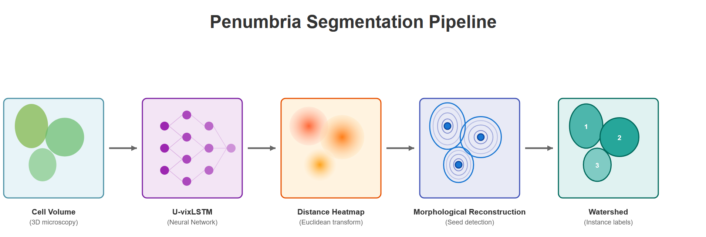

# Penumbria

**Precision 3D segmentation for biological imaging**

Penumbria is a deep learning algorithm for accurate 3D cell segmentation in microscopy images. It uses a U-vixLSTM backbone to frame segmentation as image regression over the Euclidean distance to cell boundaries, then applies morphological reconstruction and watershed transformation to generate instance labels. Penumbria excels at high-precision boundary delineation, making it ideal for analyses requiring precise morphological fidelity.

## Pipeline Overview



Penumbria works in three main steps:

1. **Data preparation**: Convert your labeled images into training-ready heatmaps using Euclidean distance transforms
2. **Training**: Train a 3D neural network to predict cell boundaries
3. **Segmentation**: Apply the trained model to new images and extract individual cell instances

## Performance


## Installation

1. Clone the repository and navigate into the folder:
```bash
git clone https://github.com/postnubilaphoebus/Penumbria.git
```
```bash
cd Penumbria
```

2. Create a conda environment:
```bash
conda create -n penumbria
```
```bash
conda activate penumbria
```

3. Install PyTorch and torchvision separately (we're using PyTorch 2.5.1, but other versions should work):
```bash
pip install torch torchvision
```

4. Install remaining dependencies:
```bash
pip install -r requirements.txt
```

## Quick Start

### Step 1: Prepare Your Training Data

First, you need to convert your raw images and label masks into heatmaps that the network will learn from.

```bash
python 1_prepare_training_data.py \
  --base_path /path/to/your/data \
  --dataset_name zebrafish \
  --output_path prepped_data
```

**Arguments:**
- `--base_path`: Directory containing your images and label masks
- `--dataset_name`: Name for your dataset
- `--output_path`: Where to save the prepared data (default: "prepped_data")
- `--img_filter`: String to identify image files (default: "img")
- `--resizing_factors`: Optional resizing factors for anisotropic data (e.g., `--resizing_factors=7,1,1`)

This script creates Euclidean distance transform heatmaps from your labels, which serve as training targets for the network.

### Step 2: Train the Network

The easiest way to train is using a configuration YAML file:

```bash
python 2_segment.py --config config.yaml
```

**Sample config.yaml:**
```yaml
training:
  training_iterations: 6000
  evaluation_interval: 20
  in_channels: 1
  data_dimensionality: 3
  mixed_precision: true
  dynamic_cropping: false
  training_image_shape: [64, 64, 64]
  val_indices: [0, 4]
  verbosity_flag: true
  data_augmentation_types:
    - rotate
    - motion_blur
    - gaussian_noise
  mini_batch_size: 1
  early_stopping_patience: 8000
  training_folder: "datasets/zebrafish_euclid"
  inference_folder: null
  inference_resolution_upsampling: null

inference:
  test_time_augmentation: true
  keep_size: [32, 32, 32]
  step_size: [32, 32, 32]
  inference_indices: [1]

postprocessing:
  parameter_tuning: false
  cell_prominence: 0.23
  cell_confidence_minimum: 0.51
  background_threshold: 0.06
  minimum_cell_size: 9
  gaussian_smoothing: true
  simple_thresholding: false

# The following sections are auto-populated and generally don't need changes:
label_transform:
  high_value: 20.0
  low_value: -20.0
  background_maximum: -5.0
  foreground_minimum: -2.0
  ignore_index: -100

model:
  optimizer: sgd
  learning_rate: 0.001
  load_pretrained: false
  momentum: 0.9
  model_weights_path: "best_model.pth"
```

## Configuration Guide

### What You'll Likely Need to Change

**`training_folder`**: Path to your prepared training data

**`inference_folder`**: Path to test images (leave as `null` for cross-validation)

**`inference_resolution_upsampling`**: If your test images have different resolution than training images, specify the upsampling factors here (e.g., `[2, 1, 1]`)

### Training Parameters Explained

**`training_iterations`**: How many training steps to run
- For small datasets where entire images fit in memory: Use ~1500 iterations per training image
  - Example: 4 training images → 6,000 iterations
- For large datasets with big images (>128³): Use 100,000 iterations with `dynamic_cropping: true`

**`dynamic_cropping`**: Set to `true` when your images are larger than what fits in GPU memory
- Maximum safe image size is ~128³ (192³ absolute maximum)
- When enabled, the network samples random crops during training

**`training_image_shape`**: Size of image patches used during training
- Keep at [64, 64, 64] or [128, 128, 128] for most cases
- Can go up to [192, 192, 192] if you have enough GPU memory
- Needs to be cubic and divisible by 32 due to model architecture (U-vixLSTM)

**`val_indices`**: Which images to use for validation (zero-indexed)

### Inference Parameters

**`test_time_augmentation`**: 
- `true`: Network makes predictions on multiple augmented versions and averages them (better accuracy, slower)
- `false`: Single prediction pass (faster, slightly lower accuracy)
- Recommendation: Keep `true` if using GPU and reasonable dataset sizes

**`keep_size` and `step_size`**: 
- These control sliding window inference (how the network processes large images)
- **Best practice**: Set both to half of `training_image_shape`
  - Example: If `training_image_shape: [64, 64, 64]`, use `keep_size: [32, 32, 32]` and `step_size: [32, 32, 32]`
- The network predicts overlapping patches and blends them using Euclidean distance feathering

### Postprocessing Parameters

After training, you'll fine-tune these parameters on your validation set to optimize cell detection.

**`parameter_tuning`**: 
- `false`: Use preset values below
- `true`: Run automated parameter search on validation data (recommended)

**`cell_prominence`**: Controls seed detection sensitivity (corresponds to h-dome transform height)

**`cell_confidence_minimum`**: Minimum confidence score to keep a detected cell

**`background_threshold`**: Threshold for distinguishing background from foreground

**`minimum_cell_size`**: Minimum voxel count for a cell (prevents small artifacts)

**`gaussian_smoothing`**: Apply Gaussian smoothing to heatmap before processing

**`simple_thresholding`**: 
- `false`: Use morphological reconstruction (more accurate)
- `true`: Simple thresholding (faster, use if extremely time-constrained)

### What You Can Ignore

**`label_transform` section**: These values are automatically set during data preparation and just read by the training script.

**`model` section**: Only modify if you want to load a pretrained model using `load_pretrained: true` and specifying `model_weights_path`.

All other default parameters are highly optimized and rarely need adjustment.

## Typical Workflow

1. **Prepare data**: Run `1_prepare_training_data.py` on your images and labels
2. **Train**: Run `2_segment.py` with your config file
3. **Fine-tune**: After training completes, adjust postprocessing parameters on validation data
4. **Segment**: Apply the model to your test images

## Questions?

If something isn't working or you need help understanding a parameter, feel free to open an issue!
